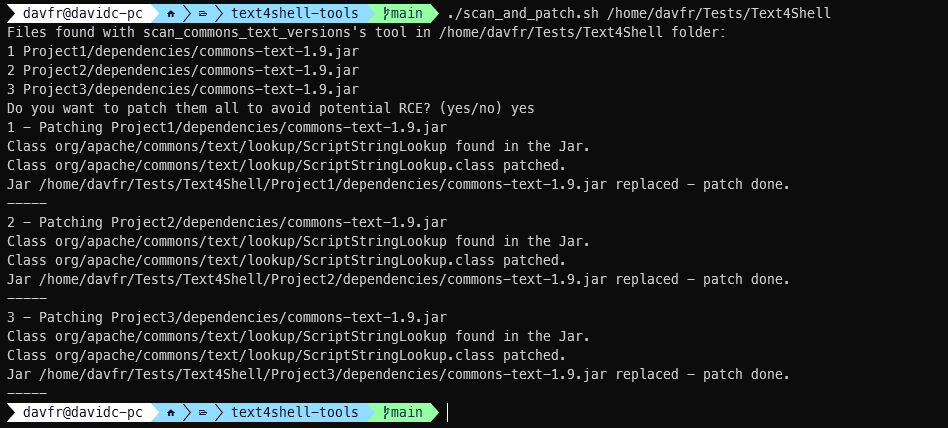

# commons-text-tools

### Quick links

Click to find:

- [Find `commons-text` .jar files and their versions](#scan_commons_text_versionspy)
- [Calls to `commons-text` vulnerable functions](#scan_commons_text_calls_jarpy) 
- [Hot patch on `commons-text` .jar files to disable the vulnerable behaviors](#text_4_shell_patch)

- [Scan and patch example](#4-can-i-automate-scanning-and-patching-of-vulnerable-commons-text-jar)


### Overview

CVE-2022-42889 may pose a serious threat to a wide range of Java-based applications. The important questions a developer may ask in this context are:

### 1. Does my code include `commons-text`? Which versions?

Does the released code include `commons-text`? Which version of the library is included there? Answering these questions may not be immediate due to two factors:

1) Transitive dependencies: while `commons-text` may not be in the direct dependency list of the project, it may be used indirectly by some other dependency.

2) The code of this library may not appear directly as a separate file, but rather be bundled in some other code jar file.

JFrog is releasing a tool to help resolve this problem: [`scan_commons_text_versions`](#scan_commons_text_versionspy). The tool looks for the **class code** of `StringLookupFactory`  **(regardless of containing `.jar` file names and content of `pom.xml` files)**, and attempts to fingerprint the versions of the objects to report whether the included version of `commons-text` is vulnerable.

### 2. Does my code use vulnerable `commons-text` functions? 

The question is relevant for the cases where the developer would like to verify if the calls to `commons-text` in the codebase may pass potentially attacker-controlled data. While the safest way to fix the vulnerability, as discussed in the advisories, is to apply the appropriate patches, controlling for and verifying the potential impact under assumption of unpatched `commons-text` may be valuable in many situations. 

[`scan_commons_text_calls_jar.py`](#scan_commons_text_calls_jarpy), which locates the calls to the vulnerable functions in *compiled .jar*s, and reports the findings as class name and method names in which each call appears.


### 3. I have vulnerable `commons-text` jar files in my system, how can I quickly disable the dangerous behavior?

* Updating remains the best solution - this solution is intented for fast hot patching

* In the context of CVE-2022-42889 vulnerability, the class `org/apache/commons/text/lookup/ScriptStringLookup` in `commons-text` enables execution of scripts which may be embedded in a string received from an attacker-controlled source through `${script}`. Therefore, invocations of `ScriptStringLookup.lookup` function are indicative of the functionality being activated.

* We provide a tool, [`Text4ShellPatch`](#text_4_shell_patch), allowing to patch this specific call so that the script execution functionality cannot be utilized. After applying the patch, the library will always execute a script returning a warning message (instead of the potentially attacker-controlled code)
* Similarly, DNS and URL lookup can load untrusted content if controlled by an attacker through `${dns}` and `${url}`, thus, their respective lookup `DnsStringLookup` and `UrlStringLookup` respectively can be disabled through patch to return a warning message,
* The patch can be applied to a specific jar file, for the `script` lookup only or `script`, `dns` and `url` for a better protection in case it is not meant to be used in the application, 
* A backup is generated in the same location as the original jar before being replaced with the patch one. The backup filename follows the following pattern: `<original_jar_name>_YYYY.MM.DD_HH.mm.ss.orig.jar` where `YYYY`, `MM`, `DD` are respectively the year, the month and the day, and `HH`, `mm`, `ss` are respectively the hour, the minutes and the second. 
* It is also possible to locate vulnerable versions of `commons-text` and patch them automatically as the next question answers to it.


### 4. Can I automate scanning and patching of vulnerable `commons-text` jar?

Two of our tools together offers the ability to scan and patch the vulnerable `commons-text` jar files. 

An example bash script is present in this Github repository under the name of `scan_and_patch.sh`. Basically, it is using the `scan_commons_text_versions.py` script to find under a specific `root-folder` the vulnerable `commons-text` jar files with a vulnerable version and run the `Text4ShellPatch` tool against them as follows.  



------

### `scan_commons_text_versions.py`
##### Usage

```
python scan_commons_text_versions.py root-folder [-quiet] [-exclude folder1 folder2 ..]
```

The tool will scan `root_folder` recursively for `.jar` and `.war` files; in each located file the tool looks for a `StringLookupFactory.class` (recursively in each `.jar` file). If at least one of the classes is found, the tool attempts to fingerprint its version (including some variations found in patches and backport patches) in order to report whether the code is vulnerable.

With `-quiet` flag, only version conclusions are printed out, and other messages (files not found/ archives failed to open/ password protected archives) are muted.

Folders appearing after `-exclude` (optional) are skipped.

------

### `scan_commons_text_calls_jar.py`

The tool requires python 3 and the following 3rd party libraries: `jawa`, `tqdm`, `easyargs`, `colorama`

##### Dependencies installation

```
pip install -r requirements.txt
```

##### Usage

The default use case:

```
python scan_commons_text_calls_jar.py root-folder
```

will recursively scan all `.jar` files in `root-folder`, for each printing out locations (class name and method name) of calls to `lookup`/`replace`/`replaceIn` methods of `StringSubstitutor`/`StringLookup`. 

The tool may be configured for additional use cases using the following command line flags.

| Flag                  | Default value        | Use                                                          |
| --------------------- | -------------------- | ------------------------------------------------------------ |
| `--class_regex`       | (.*StringSubstitutor&#124;.*StringLookup)       | Regular expression for required class name                   |
| `--method_regex`      | (lookup&#124;replace&#124;replaceIn)                 | Regular expression for required method name                  |
| `--quickmatch_string` | (StringLookup&#124;StringSubstitutor)                | Pre-condition for file analysis: .jar files not containing the specified regex will be ignored |
| `--class_existence`   | Not set              | When not set, look for calls to class::method as  specified by regexes. When set, `--method_regex` is ignored, and the tool will look for *existence* of classes specified by `--class_regex` in the jar. |
| `--no_quickmatch`     | Not set              | When set, the value of `--quickmatch_string` is ignored and all jar files are analyzed |
| `--caller_block`      | .*org/apache/commons/text | If caller class matches this regex, it will *not* be displayed |

------

### `text_4_shell_patch`
##### Usage

```
java -jar Text4ShellPatch.jar TARGET_JAR [PATCHING_MODE]
  Where TARGET_JAR is the application to patch and PATCHING_MODE is
    0 (default): Patch Script lookup
    1:           Patch Script + DNS + URL lookups
  [Note: The original Jar will be kept in the same folder with the .orig.jar extension]  
```

The tool will look for the `org/apache/commons/text/lookup/ScriptStringLookup` class in the `commons-text` jar given and replaces the `lookup()` function's content by a warning message and return out of the function. Thus, the `eval` will not exist in the new `ScriptStringLookup` class.

It can also patch the `DnsStringLookup` and `URLStringLookup` classes and disable the `lookup()` function when setting the `PATCHING_MODE` option to 1. 

A backup file is generated through the process in the same path with the `.orig.jar` extension. 

##### Generation from Code-Source

Text4ShellPatch can be edited and compiled with Maven with the simple command:
` mvn clean assembly:single `. It will create a `Text4ShellPatch.jar` file in the `target/` folder.
